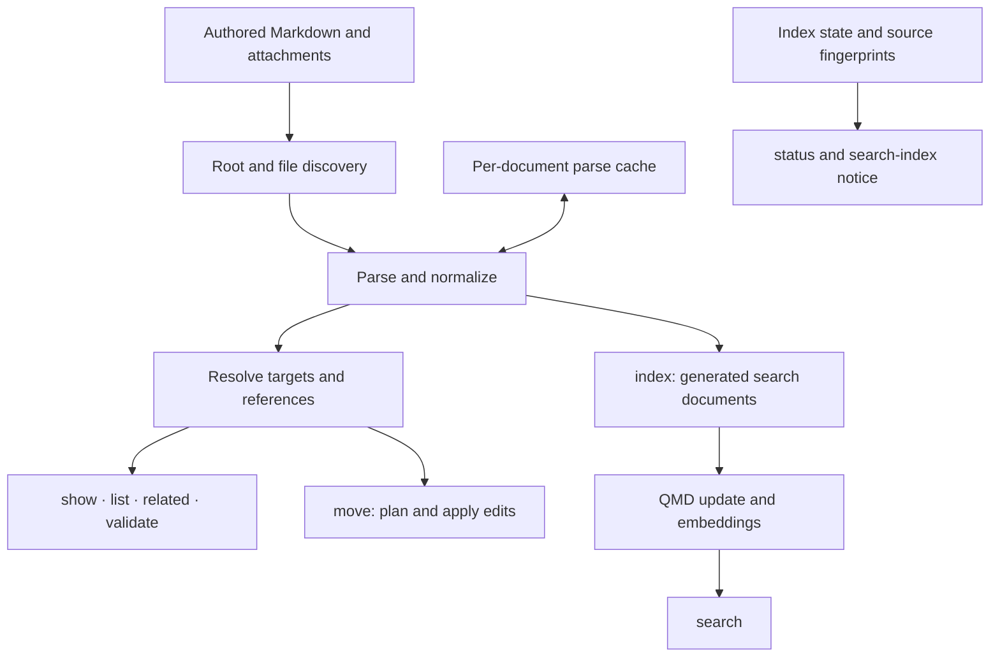

# Agent Wiki Architecture

Architecture for the [Agent Wiki format](document-format.md) and [CLI functional spec](cli-spec.md). This documents the agreed direction and proposes concrete implementation defaults; it does not describe an implemented CLI. The format spec governs authored content, and the functional spec governs commands. Internal names and interfaces below are illustrative.

The [repository setup and code-quality decisions](../contributing/tooling.md) define the strict tooling, tests, development Git hooks, and CI required from the initial setup phase.

## 1. Design and scope

Build one TypeScript package with a reusable library and a thin `wiki` executable. Markdown files are authoritative. The library derives a document/reference view for wiki operations; QMD derives a separate index for ranked retrieval. Both can be reconstructed from the files.

The initial implementation includes discovery, tolerant parsing, a parse cache, reference resolution, validation, search projection, QMD integration, and the eight commands in the functional spec. Optional indexing automation and external enrichment come later.

Keep these boundaries explicit:

- Use one document model with the shared frontmatter contract. `type` is a descriptive label, not a schema discriminator. There is no type registry, type-specific field inheritance, or arbitrary authored metadata.
- Reuse QMD for ranking, chunking, embeddings, and supported search filters. Do not build a second retrieval engine or depend on private QMD database tables.
- Persist document parse results, then reconstruct the graph in memory when needed. A graph database and an incremental dependency engine are unnecessary initially.
- Report invalid content through diagnostics while retaining usable content. Validation is an operation on the model, not a prerequisite for building it.
- Read commands do not rewrite authored files. `move` changes files only through an explicit, reviewable edit plan.
- Keep content review deadlines, search-index currency, and embedding completeness separate.

## 2. Components and dependencies



The arrows show available dependencies, not mandatory work for every command. For example, displaying a document by path does not require constructing the whole graph.

| Component          | Responsibility                                                                                                  |
| ------------------ | --------------------------------------------------------------------------------------------------------------- |
| CLI                | Parse arguments, resolve global/shared flags, call library operations, render text or JSON, and set exit codes. |
| Workspace          | Resolve the root, discover content, read source snapshots, normalize paths, and manage derived state.           |
| Parser             | Extract frontmatter, Markdown structure, reference occurrences, footnotes, and local diagnostics.               |
| Resolver and graph | Index targets and aliases, resolve authored references, and expose incoming/outgoing relationships.             |
| Operations         | Implement `show`, `list`, `related`, `validate`, and `move` using the necessary model stages.                   |
| Search adapter     | Project documents, manage a dedicated QMD store, translate filters, and normalize search results.               |
| Index coordinator  | Run refresh stages, record coverage and failures, manage embedding work, and report status.                     |

Proposed source organization:

```text
src/
  index.ts                 # Public library exports
  cli/                     # Commands, flags, output, exit handling
  workspace/               # Root discovery, file inventory, snapshots, cache
  documents/               # Contracts, frontmatter, Markdown, diagnostics
  references/              # Local/external targets, resolution, graph indexes
  operations/              # Show, list, related, validate, move
  search/                  # Projection, QMD adapter, index coordinator, status
```

Use TypeScript with ESM on a Node version supported by the selected QMD build. Use `mdast-util-from-markdown`, its GFM and frontmatter extensions, and `yaml` for parsing. Preserve source positions rather than rendering and reparsing Markdown. Choose a small CLI argument parser and an existing GitHub-compatible heading slugger; no CLI framework should leak into library contracts.

Load QMD only for operations that need it. Basic inspection and validation should work without loading model runtimes, downloading models, or opening the search database. The library should accept an injected clock for freshness calculations and an explicit root rather than depending on process-global CLI state.

## 3. Workspace and storage

### Root and paths

Follow the functional spec exactly: explicit `--root` wins; otherwise find the nearest `.agent-wiki/` in the current directory or ancestors, stopping after the Git working-tree root. Outside a Git working tree, check only the current directory. With no marker, use the original current directory.

Use a single root-relative, slash-separated path representation internally. Preserve filename case. Command paths and globs are root-relative; paths authored in Markdown or frontmatter are relative to the containing document. Aliases are lookup conveniences, never document identities or implicit link destinations.

Proposed discovery default: recursively include visible `.md` files, excluding `.agent-wiki/`, `.git/`, `node_modules/`, `.cache/`, `vendor/`, `dist/`, and `build/`. This keeps a mirror with matching relative paths compatible with the examined QMD discovery rules. Do not follow directory symlinks or ingest files whose real path escapes the root. Referenced non-Markdown files are attachment targets, not documents requiring a title or frontmatter. Keep discovery policy in one place and version it so a policy change invalidates index coverage.[^qmd-indexing]

### Derived state

```text
.agent-wiki/
  cache/
    documents.json         # Versioned normalized parses, keyed by source path
    search-documents/      # Generated Markdown mirror consumed by QMD
    qmd.sqlite             # Dedicated wiki search database
    index-state.json       # Indexed source fingerprints, versions, run status
    write.lock             # Coordination for index/move operations
  external/                # Reserved for optional future enrichment observations
```

The `external/` directory is not created in the initial implementation. Keep future observations separate from disposable caches so rebuilding search cannot erase them. QMD's model files may remain in its normal shared model cache; they need not be copied into every wiki.

Keep generated cache contents out of Git. A wiki does not need a configuration file merely to use the marker. Without a marker, ordinary read commands operate in memory rather than creating one and changing future root discovery. `index` creates the marker and cache at the resolved root. Once present, read commands may refresh the parse cache; failure to write that optional cache should not prevent reading files.

Write cache and state files through a temporary file plus rename. Missing, corrupt, or incompatible parse caches are discarded and reconstructed. Store a cache format version and parser/schema version. Do not serialize third-party AST objects or cross-document resolution state.

## 4. Core data model

Use plain immutable data contracts. Separate source-local parse results from workspace-dependent resolution.

| Model        | Essential data                                                                                                                                             |
| ------------ | ---------------------------------------------------------------------------------------------------------------------------------------------------------- |
| `Document`   | Root-relative path, source hash, display title, validated shared metadata, body span, sections, footnotes, authored references, and local diagnostics.     |
| `Section`    | Document path, heading depth/text/anchor, heading span, content span, and optional parent section.                                                         |
| `Footnote`   | Normalized identifier, definition span, use spans, and references contained in the definition. Definitions may contain explanatory text and several links. |
| `Reference`  | Owning document/section, original destination, destination span, use spans, origin, optional frontmatter field or citation key.                            |
| `Target`     | A local document, section, attachment, or external resource with a stable identity within the wiki.                                                        |
| `Resolution` | Resolved target, unresolved destination with a reason, or ambiguous candidates.                                                                            |
| `Diagnostic` | Stable code, severity, message, source path, and source span when available.                                                                               |

An illustrative source-local contract:

```ts
interface SourceSpan {
  start: number; // Inclusive JavaScript string offset in original source
  end: number; // Exclusive JavaScript string offset in original source
  line: number; // One-based
  column: number;
}

interface ParsedDocument {
  path: string;
  sourceHash: string;
  title: string;
  metadata: WikiFrontmatter;
  body: SourceSpan;
  sections: Section[];
  footnotes: Footnote[];
  references: Reference[];
  diagnostics: Diagnostic[];
}
```

`WikiFrontmatter` implements the closed set of optional fields in the format spec. Invalid values are absent from normalized metadata but retain diagnostics. The original text remains available in the current source snapshot for display, projection, and edits. Offsets must consistently refer to the original decoded string, including its line endings; byte offsets and JavaScript offsets must not be mixed.

Document identity is its path, such as `projects/wiki.md`. Section identity combines that path and its heading anchor. Cache hashes and QMD document IDs do not become public wiki identities. Moving a document changes its identity and requires updating incoming references.

### References and the graph

Build an in-memory map of targets, an alias lookup, and adjacency indexes by source and destination. Preserve reference occurrences even when several point to the same target; their locations and citation context matter. Aggregate a document's section references when displaying document-level relationships.

Distinguish these origins:

- Markdown links and images, including inline, reference-style, and autolink forms.
- Links inside footnote definitions, associated with citation use sites.
- Named frontmatter references: `about`, `authors`, `participants`, and `location`.
- The frontmatter `url`, identifying the primary external page.

The origin describes an authored relationship. A citation does not automatically establish support, and an ordinary link does not imply authorship, participation, or a principal subject. `## Sources` has no special graph behavior. A footnote without a link remains a footnote without manufacturing a target.

Resolve local links against the containing document. Resolve fragments using one shared heading-anchor implementation, including duplicate heading handling. Keep unresolved references in the model so diagnostics and inspection can show what was authored. An ambiguous alias returns candidates rather than choosing one.

### External targets

Interpret external URLs without fetching them. Small recognizers can identify GitHub pull requests, issues, commits, and files; other providers such as Linear and Slack can follow. Unrecognized URLs remain useful generic targets.

For recognized resources, include the provider host and resource namespace in identity, and retain any fragment or selector on the reference. Preserve the authored URL and label. Generic URL normalization must be conservative: do not remove arbitrary query parameters or fragments, which may identify different resources. Non-HTTP links such as `mailto:` remain addressable references but are not candidates for HTTP enrichment.

For example, two documents linking to the same GitHub PR connect to one external target. `related` can therefore show the local documents referring to that URL, even when no local file represents the PR. No live status, fetched content, or inferred relationship is needed for this shadow graph.

## 5. Parsing, validation, and refresh

### Parse pipeline

1. Read the source once and compute its content hash.
2. Parse Markdown with GFM, footnotes, and leading YAML frontmatter support.
3. Validate YAML keys and values, retaining source locations and unambiguous valid fields.
4. Extract the H1 title, sections, reference definitions/usages, footnotes, and exact destination spans.
5. Return the normalized document and local diagnostics together.

Count headings from the AST, not text matching that would mistake fenced examples for titles. Derive a display fallback from the first usable H1 or filename when the title contract is violated; do not repair the source automatically. Preserve tables, lists, code, blockquotes, and explanatory citation text in displayed slices.

Reference-style links require both the use-site span and the destination's definition span. Multiple uses of a definition share one editable destination. YAML parsing likewise needs exact value spans for reference fields. A whole-node location alone is insufficient for safe moves.

Raw HTML remains authored content; the initial resolver does not interpret HTML attributes as additional wiki link syntax. Code examples do not create graph edges. If a leading frontmatter block is malformed or unterminated, report that problem and retain readable source rather than guessing which text to delete.

### Error tolerance

| Problem                                        | Usable behavior                                                                               |
| ---------------------------------------------- | --------------------------------------------------------------------------------------------- |
| Unknown frontmatter key                        | Report it; retain supported fields and the body.                                              |
| Invalid field value or duplicate key           | Report it; omit the invalid or ambiguous field from normalized metadata.                      |
| Malformed YAML                                 | Report it; metadata is unavailable, but readable Markdown can still be displayed and indexed. |
| Missing or multiple H1 titles                  | Report it; provide a display fallback.                                                        |
| Missing target, anchor, or footnote definition | Keep the source and unresolved reference; report the problem.                                 |
| Unreadable file                                | Report an operational problem; continue other readable files and mark coverage incomplete.    |

Local diagnostics can be cached with the parse. Cross-document diagnostics are recomputed from the current inventory and graph. Freshness is evaluated using the current calendar date, not cached as a boolean.

`validate` combines these diagnostics and returns nonzero for structural errors. Selected validation still resolves against the whole wiki, but reports document diagnostics for the selected files. Expand quoted globs inside the CLI, deduplicate selections, and reject unmatched selections. An incomplete scan cannot be reported as successful whole-wiki validation.

### Refresh and cache behavior

A refresh discovers the current file set, reads and hashes files, reuses unchanged cached parses, parses changed/new files, and drops confirmed deletions. Hashes determine reuse; modification times alone are insufficient. A parser/schema version change invalidates cached parses.

Reconstruct the graph and cross-document diagnostics from the refreshed parses when needed. Do not persist adjacency lists or implement per-edge invalidation. Keep source text for the duration of the operation, then release it; the persistent cache needs normalized metadata, structure, spans, and local diagnostics rather than another full AST or duplicate document body.

If discovery is incomplete, do not interpret unvisited paths as deletions. A source read failure must not replace a previously usable record with an empty document. Cached older content, if retained for recovery, must not be presented as a successful current read.

## 6. QMD integration

### Dependency and adapter

Use a tested QMD build exposing `createStore`, collection update, embedding generation, search, metadata filters, and status. The source examined for this design contains these APIs; package version text alone is insufficient to establish that an installed build contains metadata support. Pin and test the actual dependency artifact during implementation.[^qmd-sdk]

Create one dedicated store per wiki using an explicit database path and inline collection configuration. Point its collection at `cache/search-documents/`. Avoid modifying the user's global QMD collections or using process environment changes to switch between wikis.

Keep SDK calls behind a small adapter. This localizes version changes or a later CLI-based integration without defining a general search-plugin framework. Do not use QMD's internal store or SQL tables for ingestion. The examined public `update()` consumes collection files and does not expose a per-document transformation callback.[^qmd-sdk]

### Generated search documents

Use a deterministic pure transformation from an original document snapshot to one generated Markdown file at the same relative path:

1. Replace the authored frontmatter with a generated `qmd.metadata` block.
2. Include valid supported metadata and derived values needed for lookup, display, and filtering.
3. Preserve the body and footnotes without Markdown reserialization.
4. Write only changed generated content and remove confirmed deleted files.

This materialized mirror adds a small amount of disk usage but lets QMD own its ordinary update, deletion, metadata extraction, and embedding lifecycle. An on-the-fly transformation can replace it later if a suitable public ingestion API exists; that is not a prerequisite.

| Metadata                  | Projection                                                                                                               |
| ------------------------- | ------------------------------------------------------------------------------------------------------------------------ |
| Shared authored fields    | Copy valid scalar/list values; retain date precision and serialize dates as strings.                                     |
| `type`                    | Preserve the complete authored label.                                                                                    |
| `category`, `name`        | Derive from the first and second slash-separated segments when present; plain types do not acquire an invented category. |
| Document-reference fields | Normalize paths relative to the wiki root, so equivalent references compare consistently.                                |
| `source_path`, `title`    | Record the original root-relative identity and wiki display title.                                                       |
| `source_body_line`        | Record the original body's starting line for mapping indexed body excerpts to source locations.                          |

For example, a generated file might begin:

```yaml
---
qmd:
  metadata:
    source_path: guides/retries.md
    source_body_line: 8
    title: API retries
    type: doc/guide
    category: doc
    name: guide
    about:
      - projects/api.md
    stale_after: '2026-12-01'
---
```

The body follows unchanged. These derived fields are internal search metadata, not additions to allowed authored frontmatter. Cache files are excluded from wiki validation.

QMD metadata supports scalars and homogeneous scalar arrays, with limits on size and shape. Omit empty arrays and invalid fields. A valid wiki value that exceeds QMD's metadata limits produces an indexing diagnostic and is omitted from search metadata; it does not become a format violation. Generate a valid metadata block even when the original frontmatter has errors, so one bad field does not disable all other filters.[^qmd-metadata]

Do not add indexing timestamps or a computed `stale` boolean to generated content. Derive review status at query time from `stale_after`. QMD hashes and embeds stored content including frontmatter, so metadata changes can require embeddings; deterministic projection avoids needless churn.[^qmd-metadata]

### Search and filters

Use QMD's search pipeline and candidate limits. The adapter maps wiki flags to native metadata filters:

| Wiki filter                      | QMD condition                                                                             |
| -------------------------------- | ----------------------------------------------------------------------------------------- |
| `--type`, `--category`, `--name` | Equality against the corresponding metadata key.                                          |
| `--about <path>`                 | Membership/equality against the normalized `about` array.                                 |
| `--stale`                        | `stale_after` less than or equal to today's `YYYY-MM-DD`; missing deadlines do not match. |
| Multiple filters                 | Native `and` combination.                                                                 |

Start with these supported capabilities. QMD has comparison, membership, existence, and boolean filters, but no general metadata glob operator in the examined API. Keep `--path <glob>` on `list` initially; do not implement search globs by repeatedly fetching and filtering ranked batches.[^qmd-filters]

Every returned search result must satisfy the requested filters. This does not promise the globally best filtered results or an exhaustive count: QMD's candidate windows can underfill selective queries. Preserve that contract and distinguish an unknown search total from a known complete listing.[^qmd-indexing]

Normalize results around original document paths, not generated paths or QMD content IDs. Initially show QMD's best passage per document. Obtain heading context and referenced footnote definitions from the indexed document body, parsing only returned documents when needed. Use indexed metadata for display title and freshness, and derive source lines from the preserved body plus `source_body_line`. If a match falls entirely within generated metadata, do not invent a source-body location.

Search displays an indexed snapshot. `show` reads the current file. Avoid maintaining historical graph generations, reconciling each hit against changed source, or attaching stale-offset warnings to individual results.

## 7. Index lifecycle, status, and freshness

### `index`

1. Resolve the root and acquire a simple workspace write lock.
2. Mark the index operation in progress, then refresh source snapshots and parses.
3. Generate changed mirror files and remove only confirmed deletions. Preserve the last indexed copy for temporarily unreadable sources and report the gap.
4. Call QMD `update()` for the complete collection. Do not pass only changed files as the collection glob: QMD uses the scanned file set to identify deletions.
5. Record a successful content-update baseline only when the scan and QMD update establish complete coverage. Record partial results and problems otherwise.
6. Call QMD `embed()` to generate missing embeddings. Preserve the searchable content update if embeddings fail, and record remaining embedding work.
7. Record completion state and release the lock.

An interrupted run is safe to repeat. QMD already handles unchanged content, updated content, removed documents, and missing embeddings. Its update still scans and reads the collection even when content is unchanged, which is another reason to keep it out of ordinary searches.[^qmd-indexing]

Use available SDK counts and progress callbacks. Some SDK versions expose aggregate skipped-file information rather than every underlying reason; combine that with our own source/projection diagnostics without claiming detail the API did not return.

Store source fingerprints, discovery/parser/projection versions, the QMD build identity, last successful content-update time, last fully completed run, pending embedding information, and known failures in index state. This state is operational bookkeeping, not a second graph database.

`index --rebuild` recreates derived search documents and the QMD index, regenerating embeddings as needed. It does not rewrite source files or remove future external observations. It need not discard a compatible parse cache.

### `search` and `status`

Search queries the existing index without running update or embedding first. A lightweight inventory/hash comparison against the last successful source baseline can detect edits, additions, and deletions without Markdown parsing. A missing or incompatible baseline means currency is unknown, not proven current.

Emit at most one index-level notice for stale/incomplete state, with the recovery action, for example:

> Search index is stale. Run `wiki index` to update it.

Represent the same condition once in JSON. Do not add per-result stale-index or offset warnings. A missing index produces an actionable `wiki index` instruction rather than silently building one or returning an empty successful search.

`status` reports the resolved root, whether the index exists, coverage, last successful updates, source changes or unknown currency, pending embeddings, and known problems. It must not initialize a missing index or load inference models merely to report status.

Source-content currency and embedding coverage can differ: a successful text update with failed embeddings is partially useful and needs a later retry. Preserve that distinction in status and failures; do not mark the whole indexing operation successful while requested embedding work remains.

### Content review deadlines

Evaluate `stale_after` separately using one invocation-wide local calendar date. On and after that date, the document is due for review. No field means no declared deadline. Editing or reindexing a document does not change its deadline.

`list --stale` reads current metadata, orders by oldest deadline first with a path tie-breaker, and reports days overdue. Ordinary search keeps stale documents visible and derives their review status from indexed metadata. Clock-dependent state is not persisted in the parse cache or generated corpus.

### Concurrency and automation

Serialize `index` and `move` with one workspace write lock. Read commands may proceed, subject to QMD's normal database behavior. Other editors do not honor this lock, so compare source hashes before applying planned edits; the next freshness check detects source changes made during indexing.

Start with manual `wiki index`. Optional wiki-indexing Git hooks are a convenience and should invoke the same operation without replacing existing hooks. A later debounced watcher/background process should also call that coordinator, coalesce events, and periodically rescan. File events are hints; discovery and hashes remain the correctness mechanism. A daemon, indexing-hook installer, and automatic index-before-search are not prerequisites for the first release. Development quality hooks are part of the initial repository setup.

## 8. Command implementation

| Command    | Required work and output                                                                                                                                                 |
| ---------- | ------------------------------------------------------------------------------------------------------------------------------------------------------------------------ |
| `show`     | Resolve path/anchor directly where possible; load the inventory for alias lookup. Return current source slices with heading context and referenced footnote definitions. |
| `list`     | Refresh document metadata, apply exact filters before limiting, and sort deterministically. No graph or QMD dependency.                                                  |
| `related`  | Build the reference indexes and return immediate incoming/outgoing relationships with origins and source locations. Accept local targets and external URLs.              |
| `validate` | Refresh the whole lookup context, then report local and cross-document diagnostics for the selected files. No QMD dependency.                                            |
| `index`    | Refresh, project, update QMD, generate missing embeddings, and record coverage/problems.                                                                                 |
| `status`   | Inspect source/index state and QMD status without triggering indexing or inference.                                                                                      |
| `search`   | Translate supported filters, query QMD, map paths and excerpts, and attach one index-level state notice when needed.                                                     |
| `move`     | Resolve the old/new path, construct and validate an edit plan, optionally display it, then apply precise source edits.                                                   |

Global flags work before or after the command. Share filter parsing and normalized metadata comparisons between commands; only expose filters each operation supports. `--limit` counts documents for search/list and relationships for related. Report known truncation without pretending QMD exposes an exhaustive result count.

Use stable diagnostic codes and structured operation results, with the CLI rendering readable text or JSON. Keep progress output off JSON stdout. Successful empty results differ from operational failures. Read operations may return useful data with document diagnostics; `validate` is the command that fails for structural content errors. Unreadable inputs, failed searches, incomplete indexing, and ambiguous requested targets must not look like complete successful operations.

### Safe moves

Moving a document is the only initial source-writing operation and needs a separate planning/apply boundary:

1. Require source and destination inside the wiki root and refuse destination collisions.
2. Discover a sufficiently complete reference inventory. Unrelated title or metadata-value errors need not block a move, but unreadable files or reference-bearing syntax that cannot be interpreted can prevent a safe complete rewrite.
3. Find incoming Markdown links and named frontmatter references, including links to sections of the moved document.
4. Recalculate outgoing relative references inside the moved file for its new directory, including attachments and self-references.
5. Produce edits for exact destination/value spans. Preserve labels, fragments, citation identifiers, YAML style, and all unrelated text. Change a shared Markdown reference definition once.
6. Expose the full path/content diff through `--dry-run`.
7. Before writing, verify all affected sources still match the plan's hashes, ensure patches do not overlap, and validate affected reference outcomes.
8. Stage replacements, apply the rename and patches, and report the files changed. Use temporary originals for best-effort rollback and clearly report any partial failure; a multi-file filesystem operation is not inherently atomic.

Do not reserialize whole Markdown or YAML documents. Explicitly test case-only renames on case-insensitive filesystems. After a successful move, invalidate affected cached parses and leave the search index stale for the next `index` operation.

## 9. Optional external enrichment

External target recognition is local and part of the initial graph. Fetching remote information is a separate, deferred capability provided by user-selected implementations.

A future provider needs a small standardized contract, for example:

```ts
interface ExternalEnricher {
  id: string;
  supports(target: ExternalTarget): boolean;
  enrich(
    target: ExternalTarget,
    context: { signal: AbortSignal; previous?: ExternalObservation }
  ): Promise<ExternalObservation>;
}
```

An observation should identify the target and provider, its source URL, fetch time, optional remote revision, and returned fields/content. The provider owns remote access and normalization. The core owns scheduling, cancellation, storage, and reporting; preserve the last successful observation when a later fetch fails.

Store observations under `.agent-wiki/external/` or an equivalent separate location. Do not automatically rewrite authored documents, infer authoritative remote status from an old observation, or let a search rebuild delete observations. Provider selection, credential wiring, refresh policy, and whether observations themselves become searchable are later design decisions. These plugins do not extend the authored frontmatter schema.

## 10. Performance evidence and constraints

The exploratory benchmark used synthetic documents averaging about 1.9 KB, roughly four references per document, the Markdown parser, and the examined QMD SDK. Representative timings from a warm local filesystem under Bun 1.4.2 were:

| Work                             | 1,000 documents | 10,000 documents |
| -------------------------------- | --------------- | ---------------- |
| Read source files                | 11 ms           | 110 ms           |
| Hash source text                 | 3 ms            | 14 ms            |
| Parse all documents              | 747 ms          | 6,001 ms         |
| Load normalized JSON cache       | 2 ms            | 21 ms            |
| Rebuild graph from cached parses | 2 ms            | 21 ms            |
| First QMD content update         | 731 ms          | 7,436 ms         |
| Unchanged QMD content update     | 53 ms           | 516 ms           |

These measurements exclude embedding generation, model startup/inference, complete validation, final CLI startup, and production corpus variability. They are design evidence, not latency guarantees. The benchmark graph and parser were prototypes, not the final implementation.

The resulting priorities are straightforward: cache parsing, reconstruct the graph when needed, write only changed projections, keep QMD update off the search path, and load dependencies on demand. Use modest bounded file concurrency and measure again on a representative corpus before adding stat shortcuts, workers, persistent graph storage, or more indexing machinery.

## 11. Implementation and verification

See the [implementation plan](implementation-plan.md) for the technical sequence and integration prerequisites, and [conformance scenarios](conformance.md) for durable behavioral expectations. Delivery progress and issue-specific acceptance criteria live in Linear.

## Sources

The source references below pin the revisions examined during design. Recheck the adapter contract against the exact QMD build selected for implementation.

[^qmd-sdk]: [QMD programmatic interface](https://github.com/tobi/qmd/blob/04e4dbd8245c527a88f1a8f0bda547aef9ca81fb/src/index.ts), including store creation, collection update, embedding, search, metadata filters, and status.

[^qmd-metadata]: [QMD metadata extraction and value contract](https://github.com/tobi/qmd/blob/04e4dbd8245c527a88f1a8f0bda547aef9ca81fb/src/metadata.ts), including `qmd.metadata`, scalar/array formats, limits, and indexed frontmatter.

[^qmd-filters]: [QMD metadata filter contract](https://github.com/tobi/qmd/blob/04e4dbd8245c527a88f1a8f0bda547aef9ca81fb/src/metadata-filter.ts), including equality, ordering, membership, existence, and boolean composition.

[^qmd-indexing]: [QMD store implementation](https://github.com/tobi/qmd/blob/04e4dbd8245c527a88f1a8f0bda547aef9ca81fb/src/store.ts), including collection discovery, literal paths, hashing, removals, embedding selection, and bounded search candidates.
